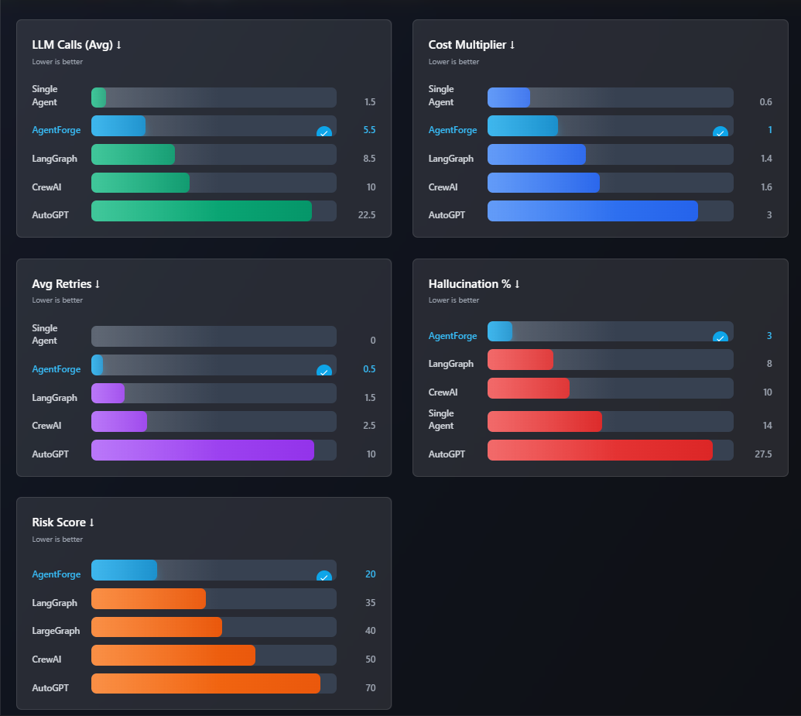

# Intellixa 🤖
**Enterprise-Grade Multi-Agent AI Orchestration Platform**

Intellixa is a **production-ready multi-agent AI orchestration system** that demonstrates **robust, scalable, and well-governed agent workflows** built using modern backend and AI engineering practices.

Rather than focusing on isolated agent behavior, Intellixa emphasizes **structured workflows, quality control, and predictable execution**, making it a robust blueprint for real-world autonomous AI systems.

---

### [Intellixa Demo](https://drive.google.com/file/d/1UaABvTABw-aO1Hugn5kGsiPHjD_hYfm5/view?usp=drive_link)

---

## 🔍 Core Concept

Large Language Models (LLMs) are powerful, but without orchestration and governance, AI-driven systems often suffer from:

- Uncontrolled API usage and escalating costs  
- Hallucinated or unreliable outputs  
- Tightly coupled or monolithic agent logic  
- Fragile execution under rate limits  
- Lack of validation and persistent context  

Intellixa is designed to address these challenges by introducing **governed multi-agent workflows** with built-in validation and correction mechanisms.

---

## 🎯 What Intellixa Provides

### 🧩 Structured Multi-Agent Orchestration
Intellixa coordinates multiple specialized agents in a deterministic pipeline, where each agent has a **single, well-defined responsibility**.

### 🛡️ Quality Validation & Confidence Control
Before delivering results, outputs are evaluated using:
- Confidence scoring  
- Hallucination risk classification  
- Identification of weak or unverifiable sections  

### 🔁 Autonomous Issue Repair
A dedicated **Reviewer agent** repairs only the problematic parts of the output, preserving correct content while improving reliability.

### ⚡ Optimized LLM Usage
- Reduced LLM calls per workflow  
- Multi-key routing to handle rate limits  
- Asynchronous, non-blocking execution  

### 🧠 Persistent Context
Session-based memory enables agents to maintain context across workflow stages, improving coherence and consistency.

---

## 🧠 High-Level Workflow

```
     CEO
      + 
   Research
      ↓
   Developer
      ↓
     Writer
      ↓
  Confidence
      ↓
   Reviewer
      ↓
     END
```
## 🏗 Architecture Overview

Intellixa is built using principles that prioritize clarity, scalability, and reliability:

- Graph-based workflow orchestration using LangGraph  
- Async-first backend design using asyncio  
- Stateless agent execution with persistent memory  
- Quality gates between workflow stages  
- Rate-limit–aware LLM access via multi-key routing 
  
---

## 🎯 Key System Capabilities

| Capability | Description |
|----------|-------------|
| Multi-Agent Orchestration | Modular and scalable agent workflows |
| Quality Validation | Confidence scoring and hallucination detection |
| API Call Optimization | Significant reduction in LLM usage |
| Async Architecture | High-throughput non-blocking execution |
| Persistent Memory | Context-aware task processing |
| REST API | External system integration |

---

## 📂 Project Structure & Setup

Intellixa maintains a clear separation between backend orchestration logic and frontend user interaction.

```
Intellixa/
├── backend/    # Multi-agent orchestration, APIs, memory, LLM logic
├── frontend/   # User interface and client-side integration
├── .env_example #Store Secrets


```

Refer to:
- **backend/README.md** for backend setup and API details  
- **frontend/README.md** for frontend setup and UI details  

---

### Design Principles
- Graph-based orchestration using LangGraph
- Async-first backend using asyncio
- Stateless agents with persistent memory
- Quality gates before final output delivery
- Rate-limit-aware LLM access

### Design Patterns Used
- Factory Pattern (LLM provider abstraction)
- Strategy Pattern (API key routing)
- Repository Pattern (database access)
- State Machine Pattern (workflow orchestration)
- Separation of Concerns (agent isolation)

---

## 🧩 Core Features

### ✔ Multi-Agent Orchestration

**Agent Pipeline with API Key Distribution:**

1. **CEO + Research Agent**
   - Creates strategic plan and task breakdown
   - Conducts initial research and market analysis
   - Combined into single LLM call for efficiency

2. **Developer Agent**
   - Generates technical artifacts and diagrams
   - Creates Mermaid flowcharts and architecture docs
   - Produces implementation specifications

3. **Writer Agent**
   - Composes final structured documents
   - Integrates research and technical content
   - Generates professional proposals and reports

4. **Confidence Agent**
   - Evaluates output quality and accuracy
   - Scores confidence (0-100) and hallucination risk
   - Identifies specific issues needing correction

5. **Reviewer Agent**
   - **Autonomously repairs** detected quality issues
   - Targets specific problems identified by Confidence agent
   - Preserves correct content while fixing errors
   - Adds disclaimers for unverifiable claims
   - Returns refined document as final output

### ✔ Quality Governance
- Confidence score (0–100)
- Hallucination risk classification (LOW / MEDIUM / HIGH)
- Identification of weak or uncertain sections

### ✔ Optimized LLM Usage
- Only **4-6 LLM calls per complete workflow**
- Multi-key load balancing
- Configurable execution delays (2s between nodes)
- Retry and fallback handling

---

## 📊 Project Metrics



- **5 specialized agents** orchestrated via LangGraph state machine
- **4-6 LLM calls per workflow** (optimized from 12+ autonomous calls)
- Persistent memory using MongoDB with session-based context
- Built-in confidence & hallucination risk scoring
- **Reviewer agent** for autonomous quality repair
- Optimized for cost, quality, and determinism 

---

## 🔄 Example Use Case

**Input:**  
```json
{
  "goal": "Write a proposal for warehouse automation technology"
}
```

**Workflow Execution:**

1. **CEO + Research** (2s) → Creates plan + conducts research
2. **Developer** (2s) → Generates technical diagrams
3. **Writer** (2s) → Composes full proposal document
4. **Confidence** (2s) → Evaluates quality, detects issues:
   - Confidence: 75%
   - Hallucination Risk: MEDIUM
   - Issues: ["AGV cost needs verification", "Timeline not validated"]
5. **Reviewer** (2s) → **Fixes detected issues:**
   - Adds cost range caveats
   - Marks timeline as estimate
   - Provides supporting context

**Final Output:**
```json
{
  "session_id": "ses_a3f7b2c1",
  "plan": { "tasks": [...] },
  "handoff": {
    "research": "Market analysis...",
    "developer": "```mermaid\ngraph TD...",
    "writer": "# Warehouse Automation Proposal...",
    "reviewer": "# Warehouse Automation Proposal (REVISED)..."  
  },
  "final": "# Warehouse Automation Proposal (REVISED)\n\nCost: $50K-100K (market estimates)...",
  "confidence": {
    "confidence_score": 75,
    "hallucination_risk": "medium",
    "hallucination_issues": ["AGV cost needs verification", "Timeline not validated"]
  }
}
```

**Key Features Demonstrated:**
- ✅ Autonomous issue detection by Confidence agent
- ✅ Targeted repair by Reviewer agent (no full rewrite)
- ✅ Quality improvement without human intervention
- ✅ Final output uses reviewed version

---

## 🛣️ Future Enhancements

- Human-in-the-loop validation
- Vector database integration
- Workflow monitoring dashboard
- Docker & CI/CD pipeline
- Parallel agent execution

---

## 👨‍💻 Author

**Deo Prakash**  

GitHub: https://github.com/deoprakash  
LinkedIn: https://www.linkedin.com/in/deo-prakash-152265225/

---

## 📄 License
Apache License

---

⭐ **Star this repository if you find it useful or insightful!**
