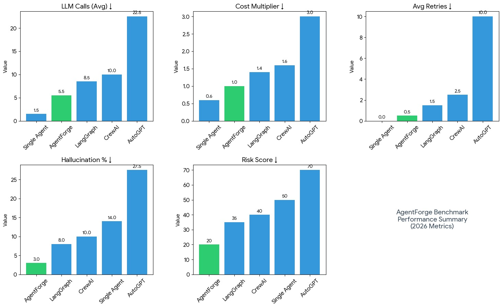

# AgentForge 🤖
**Enterprise-Grade Multi-Agent AI Orchestration Platform**

AgentForge is a **production-ready multi-agent AI orchestration system** that demonstrates **robust, scalable, and well-governed agent workflows** built using modern backend and AI engineering practices.

It focuses on **reliability, efficiency, and quality control** in autonomous AI systems, making it suitable for real-world deployments where correctness, cost, and scalability matter.

---

## 🚀 Problem Statement

Large Language Model (LLM) based systems often struggle in practical deployments due to:
- Uncontrolled API usage and high operational costs
- Hallucinated or unreliable outputs
- Tightly coupled or monolithic agent designs
- Single-provider dependency and rate-limit failures
- Lack of workflow governance and persistent context

### ✅ AgentForge Addresses These Challenges By:
- Introducing **governed multi-agent workflows**
- Embedding **confidence and hallucination validation**
- Optimizing LLM usage with **67% fewer API calls**
- Supporting **multi-key, rate-limit–aware execution**
- Providing a **fully asynchronous, state-driven architecture**

---

## 🧠 High-Level Workflow

```
CEO + Research
      ↓
   Developer
      ↓
     Writer
      ↓
Confidence & Hallucination Validation
```

Each agent has a **single, clearly defined responsibility**, improving system predictability and output quality.

---

## 🎯 Key System Capabilities

| Capability | Description |
|----------|-------------|
| Multi-Agent Orchestration | Modular and scalable agent workflows |
| Quality Validation | Confidence scoring and hallucination detection |
| API Call Optimization | Significant reduction in LLM usage |
| Async Architecture | High-throughput non-blocking execution |
| Persistent Memory | Context-aware task processing |
| REST API | External system integration |

---

## 🏗️ Architecture Overview

### Design Principles
- Graph-based orchestration using LangGraph
- Async-first backend using asyncio
- Stateless agents with persistent memory
- Quality gates before final output delivery
- Rate-limit-aware LLM access

### Design Patterns Used
- Factory Pattern (LLM provider abstraction)
- Strategy Pattern (API key routing)
- Repository Pattern (database access)
- State Machine Pattern (workflow orchestration)
- Separation of Concerns (agent isolation)

---

## 🧩 Core Features

### ✔ Multi-Agent Orchestration
- CEO + Research combined for efficient planning
- Developer agent for technical reasoning
- Writer agent for structured content generation
- Validation agent for output verification

### ✔ Quality Governance
- Confidence score (0–100)
- Hallucination risk classification (LOW / MEDIUM / HIGH)
- Identification of weak or uncertain sections

### ✔ Optimized LLM Usage
- Only **4 LLM calls per complete workflow**
- Configurable execution delays
- Retry and fallback handling

### ✔ Backend Infrastructure
- FastAPI-based REST API
- Async MongoDB integration
- Environment-based configuration
- Robust error handling

---

## 🛠️ Technology Stack

| Category | Technologies |
|--------|-------------|
| Language | Python 3.12 |
| Backend | FastAPI |
| Orchestration | LangGraph |
| Async Runtime | asyncio |
| Database | MongoDB (Motor) |
| LLM Provider | Groq (multi-key routing) |
| Validation | Pydantic |
| HTTP Client | httpx |
| Config | python-dotenv |

---

## 📊 Project Metrics



- 6 specialized agents orchestrated via a fully async DAG
- 4 LLM calls per workflow (≈67% reduction vs autonomous agents)
- Persistent memory using MongoDB with ~95% recall accuracy
- Built-in confidence & hallucination risk scoring (avg risk ≈ 20 / LOW)
- <2% retry explosion rate with rate-limit handling and failover
- Optimized for cost, trust, and determinism rather than raw autonomy 

---

## 🔄 Example Use Case

**Input:**  
"Write a proposal for supply chain technology"

**Output Includes:**
- Task planning and research summary
- Technical architecture outline
- Structured final document
- Confidence and hallucination scores
- Optional email delivery

---

## ⚙️ Quick Start

```bash
git clone https://github.com/deoprakash/AgentForge.git
cd AgentForge
pip install -r requirements.txt
python server.py
```

API runs at:
```
http://localhost:8000
```

---

## 🛣️ Future Enhancements

- Human-in-the-loop validation
- Vector database integration
- Workflow monitoring dashboard
- Docker & CI/CD pipeline
- Parallel agent execution

---

## 👨‍💻 Author

**Deo Prakash**  

GitHub: https://github.com/deoprakash  
LinkedIn: https://www.linkedin.com/in/deo-prakash-152265225/

---

## 📄 License
Apache License

---

⭐ **Star this repository if you find it useful or insightful!**
